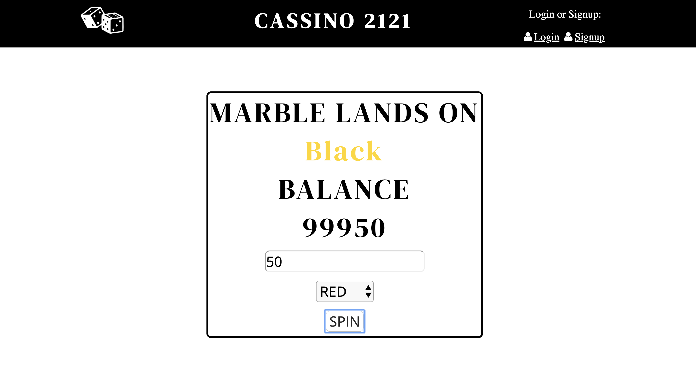

# 🎰 HOUSE CASS - CASSINO ROULETTE

I recreated a casino classic - the roulette table. The casino is able to login and see each winning bet on a ledger.

### Development:
**Languages Used:** HTML & CSS, JavaScript, Node.js, MongoDB

### Optimizations:
I would change the true/false on the ledger to include the amounts bet and the total won/loss.

## Installation

1. Clone repo
2. run `npm install`

## Usage

1. run `node server.js`
2. Navigate to `localhost:3030`
